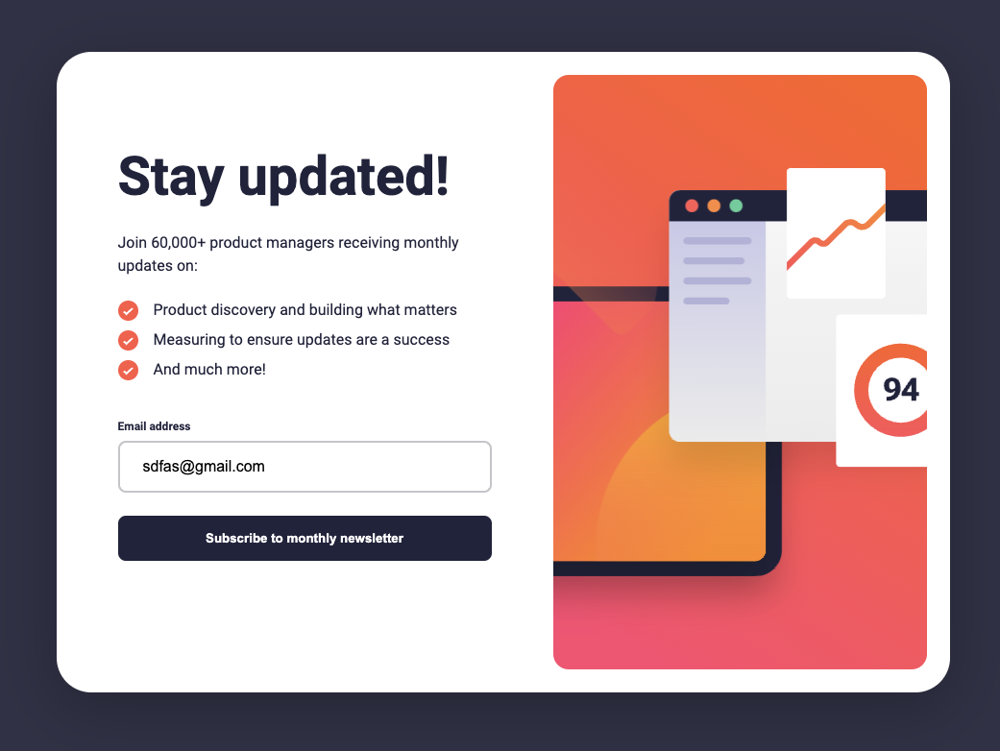

# Newsletter Signup Page (Frontend Mentor)

This is a solution to the [Newsletter Signup Page challenge on Frontend Mentor](https://www.frontendmentor.io/challenges/newsletter-signup-form-with-success-message-3FC1AZbNrv/). Frontend Mentor challenges help you improve your coding skills by building realistic projects.

## Overview

### The challenge

Users should be able to:

- Add their email and submit the form
- See a success message with their email after successfully submitting the form
- See form validation messages if:
  - The field is left empty
  - The email address is not formatted correctly
- View the optimal layout for the interface depending on their device's screen size
- See hover and focus states for all interactive elements on the page

### Screenshot

### Links

- Live Site URL: [Netlify](https://jakegodsall-newsletter-signup-page.netlify.app/)

## My process

### Built with

- Semantic HTML5 markup
- CSS custom properties
- Flexbox
- Mobile-first workflow

## Author

- Website - [Jake Godsall](https://jakegodsall.com)
- Frontend Mentor - [@jakegodsall](https://www.frontendmentor.io/profile/jakegodsall)
- LinkedIn - [@godsalljake](https://www.linkedin.com/in/godsalljake/)

## License

This project is open source and available under the [MIT License](https://github.com/jakegodsall/fm-newsletter-signup-page/blob/main/LICENSE).
